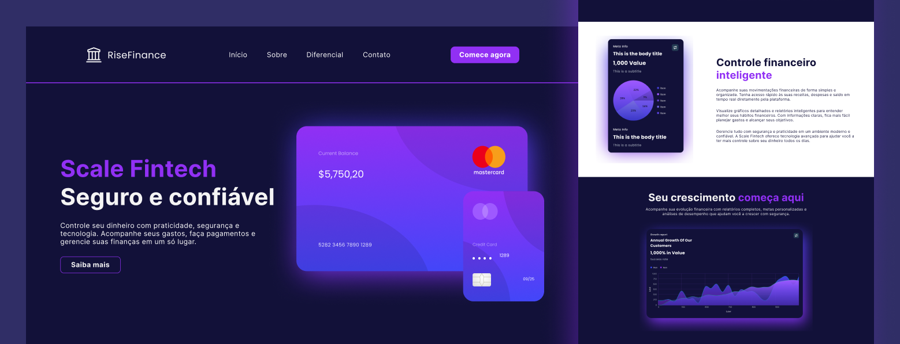

<!-- MODELO PROJETO FINALIZADO -->
<h1 align="center"> 
	  ✅ Fintech - Concluído ✅
</h1>

<!-- ---------------------------------------------------------------------- -->

<!-- MODELO MENU DE NAVEGAÇÃO -->

 <a href="#-descrição-do-entregável">Descrição do entregável</a> •
 <a href="#-sobre-o-projeto">Sobre</a> •
 <a href="#-layout">Layout</a> • 
 <a href="#-como-executar-o-projeto">Como executar</a> • 
 <a href="#-tecnologias">Tecnologias</a> • 
 <a href="#-autor">Autor</a>

## 📄 Descrição do entregável

- src (Estrutura geral do projeto: imagens, estilos, etc.)

- index.html (Arquivo principal do projeto)

## 💻 Sobre o projeto

<!-- EXPLICA O MOTIVO DO PROJETO -->
Fintech é um projeto desenvolvido durante o curso de Desenvolvedor Front-End com o objetivo de praticar a construção de páginas web utilizando HTML e CSS, com foco em boas práticas de semântica, organização de código e estruturação de layouts.

## 🎨 Layout

## 🚀 Como executar o projeto

1 - Baixar o projeto  
2 - Executar o arquivo index.html

### Pré-requisitos

Antes de começar, você vai precisar ter instalado em sua máquina a seguinte ferramenta:
Um editor para trabalhar com o código como [VSCode](https://code.visualstudio.com/).

## 🛠 Tecnologias

As seguintes ferramentas foram usadas na construção do projeto:

#### **Front-End**

- **HTML**
- **CSS**

#### **Prototipação** ([Figma](https://www.figma.com/))

## 🦸 Autor

<a href="https://www.linkedin.com/in/onita-lombardi">Onita Lombardi</a>

